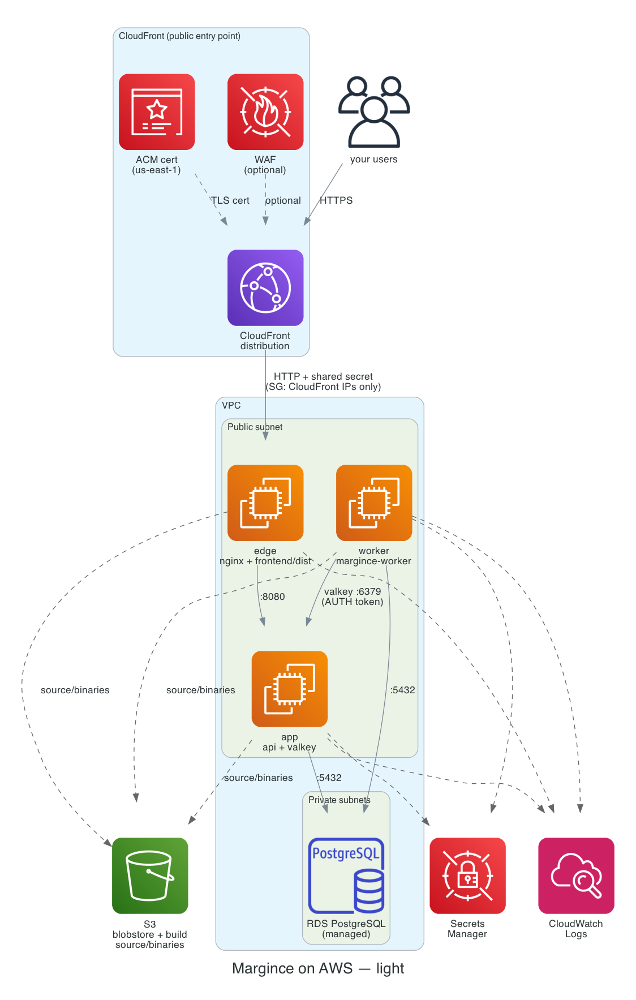

# Margince on AWS — light

Three EC2 instances — **edge** (nginx + the built frontend, public via
CloudFront), **app** (api + a natively-installed valkey), **worker** — plus
managed RDS for PostgreSQL. No Docker, no ECR, no ElastiCache, no ALB, no
ECS. Every instance compiles its own piece from source at boot (Go/Node
directly, not containers). See [the standard stack](../standard/README.md) for the
production-shaped alternative this trades against.

```
                    ┌─────────────────────┐
  the internet ───► │  CloudFront + ACM   │  (public entry point — TLS terminates here)
                    └──────────┬──────────┘
                               │ HTTP, shared-secret header
                               ▼
                    ┌─────────────────────┐
                    │  edge (public IP)   │  nginx: routes /v1* etc → app,
                    │  nginx + frontend/  │  serves frontend/dist itself
                    │       dist          │
                    └──────────┬──────────┘
                               │ :8080
                               ▼
                    ┌─────────────────────┐        ┌─────────────────────┐
                    │  app                │◄───────┤  worker             │
                    │  margince-api       │  :6379  │  margince-worker    │
                    │  valkey (localhost  │         │                     │
                    │   + reachable from  │         │                     │
                    │   worker)           │         │                     │
                    └──────────┬──────────┘         └──────────┬──────────┘
                               │ :5432                          │ :5432
                               └───────────────┬─────────────────┘
                                                ▼
                                      RDS PostgreSQL (managed)
```



*Solid arrows: the request/data path. Dashed: build-source-and-artifact
traffic to S3, secrets fetched at boot, logs shipped to CloudWatch. Dotted
red: not applicable here (this stack has no customer-managed KMS key — see
"What this is NOT"). Regenerate from `docs/diagrams/aws-light.py` after a
real architecture change — see `docs/diagrams/README.md`.*

## What this is NOT

Read this before you provision it:

- **Not containerized.** api/worker/nginx/valkey all run as native systemd
  services, compiled/installed directly on their instance. This means the
  build toolchain (Go, and Node/pnpm on edge) lives permanently on the same
  box that serves traffic — normally you'd build somewhere isolated and
  ship only the artifact. It also means no automatic base-image patching
  the way a fresh Docker build would give you; OS package updates on a
  running instance are on you (`dnf update`, by hand or your own
  automation — this stack doesn't script it).
- **A hand-rolled second build system.** The real one is the root
  `Dockerfile` + `docker-bake.hcl`, used by CI/release and the full stack.
  `templates/user_data-*.sh.tpl` reimplements those exact build steps in
  bash — if the Dockerfile's build steps change, these three templates need
  updating by hand to match, or they silently drift.
- **No autoscaling, no multi-AZ compute.** One instance per role. A
  traffic spike or instance failure means replacing that instance
  (`terraform taint aws_instance.<role> && terraform apply`), not traffic
  shifting to a healthy peer — there is no peer.
- **Single-AZ database.** RDS runs `multi_az = false`. Recovery from an
  underlying host failure is "restore from the last backup/snapshot."
- **No customer-managed KMS key.** Everything at rest (RDS, S3, Secrets
  Manager) uses the relevant service's own AWS-managed default key.
- **ACM's DNS validation is a manual step.** This stack has no Route53
  integration — see step 3 below.

If any of the above is a hard requirement, use [`../standard/`](../standard/) instead.

## What this keeps, deliberately

Encryption at rest everywhere (AWS-managed keys), `rds.force_ssl` +
`sslmode=verify-full` on both database DSNs, IMDSv2-only on every instance,
no SSH ingress anywhere (shell access is via SSM Session Manager only), IAM
scoped per-role to exactly what that role's own process reads (worker
can't even read the admin-bootstrap password or the license), and
CloudFront's origin-facing IP range plus a shared-secret header standing
between the public internet and the edge instance's own security group —
nothing here is reachable by a raw IP address someone found.

## Configuration reference — one section per file

Read this before changing anything; each resource group's own knobs and
what adapting them costs.

### `variables.tf` — the operator-facing knobs

Four have no default (must be set in `terraform.tfvars`):

- **`public_base_url`** — e.g. `https://crm.example.com`. Its host becomes
  the ACM certificate's domain, CloudFront's alias, and nginx's
  `server_name`. Changing this after first apply means a new ACM
  cert + a new manual DNS validation (step 3).
- **`admin_bootstrap_password`** — `MARGINCE_ADMIN_PASSWORD` for the very
  first boot. Rotate/remove per the Margince repository's `docs/deployment.md` once the organization
  exists (step 8).
- **`image_tag`** — the release identifier all three instances build (or
  pull from their own S3 artifact cache) and run. Bump this to release a
  new version (step 9) — never reuse a tag once it's been built.
- **`license_token`** — empty runs unlicensed; the api/worker refuse to
  fully start without a real one (see "First login" below).

Everything else has a working default:

- **`aws_region`** (`eu-central-1`) — where every resource lives, except
  the CloudFront/ACM/WAF resources in `cloudfront.tf`, which are always
  us-east-1 regardless of this value (a CloudFront/ACM API requirement, not
  a choice this stack makes).
- **`name_prefix`** (`margince-light`) — prefixes every resource name; change
  it to run more than one instance of this stack in the same account.
- **`environment`** — stamped as the `Environment` tag on every resource
  (provider `default_tags`, `versions.tf`); the dimension a cost tool groups
  by if you reuse `name_prefix` across environments.
- **`vpc_cidr`** / **`az_count`** — the VPC's address space and how many
  AZs the RDS subnet group spans (RDS requires ≥2 even single-AZ; compute
  itself uses one public subnet regardless of this value, see `network.tf`).
- **`cpu_architecture`** (`arm64`) — picks the instance/AMI family. Building
  natively means there's no separate "did you push the right platform"
  concern the old Docker version had — each instance's own `uname -m`
  drives its build, this only has to match what you actually launch.
- **`instance_type`** (`t4g.small`) / **`root_volume_gb`** (`40`) — shared
  across all three instances. Sizing them differently per role (edge/app
  need real headroom for their build toolchain + build cache; worker needs
  less) is a real improvement this variable doesn't yet make — bump the
  shared value if any one role's build is failing for lack of memory/disk,
  or fork the variable into `edge_instance_type`/`app_instance_type`/etc.
  if you want to size them independently.
- **`db_instance_class`**, **`db_allocated_storage_gb`**,
  **`db_engine_version`**, **`db_backup_retention_days`**,
  **`db_final_snapshot_generation`** — RDS sizing (`rds.tf`). Bump
  `db_final_snapshot_generation` before destroying/recreating the RDS
  instance in the same state, so the final-snapshot suffix doesn't collide
  with a previous deletion's snapshot.
- **`log_retention_days`** (`14`) — CloudWatch Logs retention for all three
  instances' log groups (`iam.tf`).
- **`enable_deep_monitoring`** (`false`) — adds an SNS topic + a
  StatusCheckFailed alarm per instance (`alarms.tf`). Off by default so you
  don't get a half-wired SNS topic with nothing subscribed to it.
- **`enable_waf`** (`false`) — attaches a WAFv2 web ACL (AWS managed rule
  groups only) to the CloudFront distribution (`cloudfront.tf`). The
  origin-facing-prefix-list SG restriction is the floor this stack keeps
  either way; WAF is the opt-in extra.

### `network.tf` — VPC, subnets, four security groups

One VPC, one public subnet (all three instances live here — nothing here
is highly available enough to benefit from AZ spread), two private
subnets (RDS's subnet group only, which requires two AZs). No NAT gateway:
every instance gets an auto-assigned public IP for outbound internet
(package installs, S3, Secrets Manager, Go/npm registries), and inbound is
locked down by security group, not subnet placement.

Four security groups, each naming exactly which OTHER security group may
reach it (never a bare CIDR, except edge's own CloudFront-prefix-list
rule):

- **`sg-edge`** — ingress 80 from CloudFront's own IP range only (a
  `data "aws_ec2_managed_prefix_list"`, not `0.0.0.0/0`). Egress to app:8080
  and the internet (443, for its own build).
- **`sg-app`** — ingress 8080 from edge, 6379 from worker. Egress to RDS
  (5432), the internet (443, mail ports).
- **`sg-worker`** — no ingress from anywhere. Egress to app:6379, RDS:5432,
  the internet.
- **`sg-db`** — ingress 5432 from app and worker only. No egress (RDS never
  originates outbound traffic).

Three pairs of rules are `aws_security_group_rule` resources instead of
inline `ingress`/`egress` blocks (edge↔app, app↔worker, app/worker↔db) —
each pair is two security groups referencing each other's ID, which
Terraform can't resolve as inline blocks in the same apply (a real
dependency cycle). Adding a new cross-instance rule that goes BOTH
directions needs the same treatment; a one-directional rule (like app's
egress to the internet) can stay inline.

**To adapt:** widening `sg-edge`'s ingress back to `0.0.0.0/0` defeats the
entire point of fronting this with CloudFront — don't, unless you're also
removing CloudFront and accepting the tradeoffs that were the whole reason
it's there (hiding the origin's IP, TLS/WAF for less than an ALB costs).

### `iam.tf` — three roles, least-privilege per role

No shared role anymore. Each instance's own role reads only:

| Role | Secrets Manager | S3 |
|---|---|---|
| edge | none | `source/<tag>.zip` (read), `binaries/edge-<tag>.tar.gz` (read/write) |
| app | everything (owner_dsn, app_dsn, redis_password, keyvault/webhook/connector keys, admin_password, license, blobstore keys) | same shape, `binaries/app-<tag>.tar.gz` |
| worker | everything EXCEPT owner_dsn/admin_password/license | same shape, `binaries/worker-<tag>.tar.gz` |

**To adapt:** if you add a new secret the api or worker needs to read, add
it to BOTH the relevant `data "aws_iam_policy_document"` block here AND the
matching `local.app_secrets`/`local.worker_secrets` list in `ec2.tf` — the
IAM grant and the fetch-list are two places carrying the same invariant on
purpose (least-privilege review vs. what actually gets fetched), and they
need to agree.

### `ec2.tf` — the three instances

Each instance: one `aws_instance`, its own IAM instance profile, its own
`templatefile()`-rendered user-data. `local.nginx_conf` (edge only) folds
in the API routing rules AND the static-frontend-serving rules that used
to belong to two separate things (a reverse proxy and a "web" container) —
there's no separate web process now, edge serves the built frontend
directly. `random_password.origin_verify` is the shared secret CloudFront
injects and nginx checks — regenerating it (e.g. by tainting the resource)
requires a coordinated redeploy of both edge (new nginx config) and
`cloudfront.tf` (new origin header) in the same apply, since Terraform
already keeps them referencing the same value.

**To adapt:** adding a role (say, a dedicated instance for a background
report generator) means a fourth `aws_instance` here, a fourth security
group in `network.tf`, a fourth IAM role in `iam.tf`, and a fourth
`templates/user_data-<role>.sh.tpl` — this is the pattern to copy, not a
single shared template to parameterize further.

### `templates/user_data-{edge,app,worker}.sh.tpl` — the native build

Each: installs its own toolchain only (edge needs Go — only to run the
composition codegen step, not to build a Go binary — AND Node/pnpm;
app/worker need Go only), checks its own S3 artifact cache first
(`binaries/<role>-<tag>.tar.gz`), builds from the shared source archive
if missing, publishes what it built, and (app/worker) reuses
`scripts/deploy/api-entrypoint.sh` / `worker-entrypoint.sh` VERBATIM as the
systemd `ExecStart` — those scripts already handle migrations and the
admin-password bootstrap; nothing here reimplements that logic.

**To adapt:** a pinned toolchain version bump (Go, Node) means editing the
`GO_VERSION`/`NODE_VERSION` line in the relevant template(s) — these are
NOT sourced from a single shared variable, so bumping Go means editing it
in all three templates that use it (edge, app, worker), and Node only in
edge's.

### `cloudfront.tf` — the public entry point

`aws_acm_certificate` (us-east-1) + `aws_acm_certificate_validation` (waits
for DNS validation — see step 3), an optional `aws_wafv2_web_acl`
(`var.enable_waf`), and the `aws_cloudfront_distribution` itself: origin is
the edge instance's public IP over plain HTTP (TLS terminates at
CloudFront, not the origin), `price_class = "PriceClass_100"` (North
America + Europe only — the cheapest tier), caching disabled
(`min/default/max_ttl = 0` — this proxies a dynamic app, not a static site).

**To adapt:** if most of your traffic is static-asset-heavy and you want
real caching, add a second `ordered_cache_behavior` for `/assets/*` with a
real TTL — `frontend/nginx.conf`'s own rules already mark that path
immutable, CloudFront just isn't told to trust that yet. Widening
`price_class` to `PriceClass_All` reaches more edge locations at a real
cost increase.

### `secrets.tf` / `s3.tf` — credentials and the blobstore bucket

Same shape as before: one Secrets Manager secret per credential, DSNs
built from `aws_db_instance.this.address` (RDS, unchanged),
`redis_host = aws_instance.app.private_ip` (valkey now runs on the app
instance itself, not a managed endpoint — see `network.tf`'s note on why
this crosses a real network hop for worker). The blobstore IAM user (used
by api/worker for attachment storage) is explicitly denied `config/*`,
`source/*`, and `binaries/*` — it has no legitimate reason to touch any of
those.

### `build.tf` — the shared source archive

Unchanged in shape from the Docker-based design: one `archive_file` zips
the repo root (excludes derived from `.dockerignore`, plus a few
S3-persistence-specific ones — see the file's own comments), uploaded to
`source/<tag>.zip`. All three instances read the SAME object — the
frontend build's codegen step needs the whole repo regardless of which
piece a given instance is building, so there's no reason to split it.

## 1. Provision

```bash
export MARGINCE_REPO=~/src/margince           # Margince source checkout at the commit to deploy
export TF_VAR_margince_source_dir="$MARGINCE_REPO"
cd deploy/production/aws/light
cp backend.hcl.example backend.hcl             # your protected state bucket
cp terraform.tfvars.example terraform.tfvars   # fill in public_base_url, admin_bootstrap_password, image_tag
# Without TF_VAR_margince_source_dir, margince_source_dir defaults to a
# margince checkout next to this repository's checkout.
terraform init -backend-config=backend.hcl
```

## 2. Request the ACM certificate (targeted apply)

```bash
terraform apply -target=aws_acm_certificate.this
terraform output acm_validation_record
```

## 3. Add the DNS validation record

ACM's DNS validation needs a CNAME with your DNS provider — this stack has
no Route53 integration, so add `acm_validation_record`'s `name`/`value` as
a CNAME record yourself, and wait for it to propagate before continuing.

## 4. Validate the certificate and provision everything except the instances

```bash
terraform apply -target=aws_acm_certificate_validation.this
terraform apply \
  -target=aws_db_instance.this -target=aws_s3_bucket.blobstore -target=aws_s3_object.source \
  -target=aws_iam_instance_profile.edge -target=aws_iam_instance_profile.app -target=aws_iam_instance_profile.worker
```

## 5. Upload `margince.yaml`

```bash
BUCKET="$(terraform output -raw s3_blobstore_bucket)"
aws s3 cp "$MARGINCE_REPO/config/margince.example.yaml" "s3://${BUCKET}/config/margince.yaml"
# edit locally first, or edit-then-recopy per the Margince repository's docs/deployment.md
```

## 6. Create the three instances and CloudFront

```bash
terraform apply
```

This creates edge/app/worker (each builds its own piece from source — the
first boot for a new `image_tag` is noticeably slower than a later one that
finds its S3 artifact cache already populated) and the CloudFront
distribution pointing at edge. Watch a boot with:

```bash
aws ssm start-session --target "$(terraform output -raw app_instance_id)"
sudo tail -f /var/log/cloud-init-output.log
```

## 7. Point DNS at CloudFront

```bash
terraform output -raw cloudfront_domain_name
```

CNAME `public_base_url`'s host to that value (or an ALIAS/ANAME record at
the zone apex, if your DNS provider supports one).

## 8. Bootstrap the database

Same shape as before — resolve credentials, port-forward through the app
instance (it already sits in the same VPC as RDS):

```bash
INSTANCE_ID="$(terraform output -raw app_instance_id)"
RDS_ENDPOINT="$(terraform output -raw rds_endpoint)"
MASTER_PW="$(terraform show -json | jq -r '.values.root_module.resources[] | select(.type=="random_password" and .name=="rds_master") | .values.result')"
OWNER_PW="$(aws secretsmanager get-secret-value --secret-id "$(terraform output -json secret_arns | jq -r .owner_dsn)" --query SecretString --output text | sed -E 's#.*:([^:@]+)@.*#\1#')"
APP_PW="$(aws secretsmanager get-secret-value --secret-id "$(terraform output -json secret_arns | jq -r .app_dsn)" --query SecretString --output text | sed -E 's#.*:([^:@]+)@.*#\1#')"

curl -fsSL https://truststore.pki.rds.amazonaws.com/global/global-bundle.pem -o /tmp/rds-ca-bundle.pem

aws ssm start-session --target "$INSTANCE_ID" \
  --document-name AWS-StartPortForwardingSessionToRemoteHost \
  --parameters "host=$RDS_ENDPOINT,portNumber=5432,localPortNumber=15432"

# In another terminal, from the repo root:
export PGHOST=127.0.0.1 PGPORT=15432 PGUSER=dbadmin
export PGSSLMODE=verify-full PGSSLROOTCERT=/tmp/rds-ca-bundle.pem
PGPASSWORD="$MASTER_PW" psql -v owner_pw="$OWNER_PW" -v app_pw="$APP_PW" -f scripts/deploy/db-bootstrap.sql
```

Once bootstrapped, `systemctl restart margince-api margince-worker` on
their respective instances (over SSM) picks up the newly-existing roles
immediately — `Restart=on-failure` in each systemd unit also gets there on
its own, just not instantly.

## 9. First login

Once nginx (edge) can reach a healthy `/healthz` on app, the api applies
migrations and bootstraps the organization from `MARGINCE_ADMIN_PASSWORD`.
After that, per the Margince repository's `docs/deployment.md`, remove `bootstrap_admin` from
`margince.yaml` and rotate the `admin_password` secret. A real, non-empty
`license_token` is required for api/worker to fully start — see the "What
this is NOT" section if you're testing without one.

## 10. Releasing a new version

Bump `image_tag`, `terraform apply`. Each instance's `user_data_replace_on_change`
means all three get replaced; each rebuilds its own piece from source (or
pulls it from S3 if another apply already built that tag). No rolling
deploy — this briefly stops all three during the replacement, same
tradeoff as before: one instance per role, no peer to shift traffic to.

## Security posture

- **IMDSv2 only**, **no SSH ingress** (SSM Session Manager instead) — same
  floor as before, now on all three instances.
- **CloudFront + shared-secret header + prefix-list SG restriction** is
  what replaces "the instance's own Elastic IP is the internet-facing
  thing" — nothing external ever reaches an instance's raw IP directly.
- **Secrets are not in user data** — each instance fetches them at boot via
  its own scoped `secretsmanager:GetSecretValue` grant into `/.env` (mode
  600). They are in Terraform state in plain text, which is why the S3
  backend is required (`versions.tf`).
- **valkey's AUTH token** (`secrets.tf`'s `redis_password` secret) protects
  the one real network hop this design has that a single-box design
  wouldn't — worker reaching app's valkey over the VPC, not loopback.
- **No supply-chain gate on the native build** — no SBOM, no provenance
  attestation the way the release workflow's own Docker bake has. This is
  a real, open cost of "no Docker" worth naming plainly.

## Deliberately not done

- **Secrets Manager rotation**, **remote state** — same gaps the full
  stack names, same reasons.
- **Per-role instance sizing** — `instance_type`/`root_volume_gb` are
  shared across edge/app/worker; a real tuning pass would split them.
- **CloudFront caching for static assets** — see `cloudfront.tf`'s own
  section above.
- **CloudWatch Agent metrics** — the agent config in each user-data
  template ships logs only, no custom metrics, to avoid needing
  `cloudwatch:PutMetricData` on top of the logs permissions each role
  already has.
