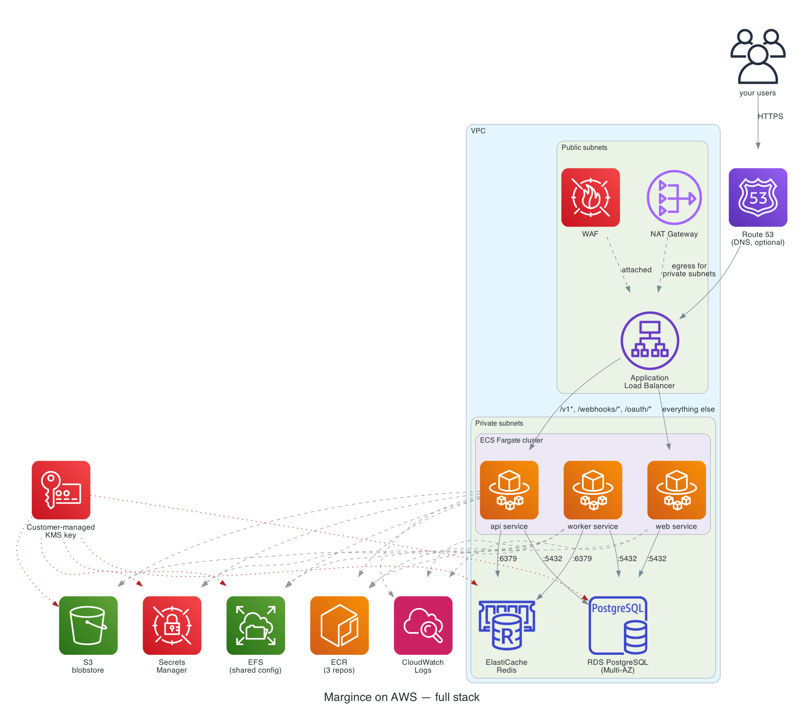

# Margince on AWS

ECS Fargate (api, worker, web), RDS for PostgreSQL, ElastiCache for Redis, S3,
EFS (for the mounted `margince.yaml`), SSM Parameter Store (SecureString), one
customer-managed KMS key, one ALB fronted by a WAFv2 web ACL, and baseline
CloudWatch alarms into an SNS topic. See the [shared
README](../README.md) for the cross-cloud design notes and what is
deliberately out of scope (autoscaling policies, multi-region/HA, DR
runbooks).



*Solid arrows: the request/data path (Route 53 → ALB → ECS services →
RDS/ElastiCache). Dashed: image pulls from ECR, EFS config mounts, Secrets
Manager/S3 access, logs shipped to CloudWatch. Dotted red: the
customer-managed KMS key encrypting RDS/ElastiCache/EFS/Secrets Manager/S3.
The diagram predates the move from Secrets Manager to SSM Parameter Store.
Regenerate from `docs/diagrams/aws.py` after a real architecture change —
see `docs/diagrams/README.md`.*

## 1. Provision

```bash
cd deploy/production/aws/standard
cp backend.hcl.example backend.hcl             # your protected state bucket
cp terraform.tfvars.example terraform.tfvars   # fill in acm_certificate_arn, public_base_url, admin_bootstrap_password, image_tag
terraform init -backend-config=backend.hcl
terraform plan

# Everything EXCEPT the 3 ECS services first — they reference image_tag,
# and nothing has pushed it yet. A plain `terraform apply` here creates the
# services anyway, pointed at a tag ECR does not have, and they sit
# unhealthy until you catch up with steps 2-4 below and re-apply. Targeting
# past them avoids that round trip entirely; it is not required, just
# cheaper than watching ECS retry a pull that cannot succeed yet.
terraform apply \
  -target=aws_ecr_repository.api -target=aws_ecr_repository.worker -target=aws_ecr_repository.web \
  -target=aws_db_instance.this -target=aws_elasticache_replication_group.this \
  -target=aws_s3_bucket.blobstore -target=aws_efs_file_system.config \
  -target=aws_efs_mount_target.config -target=aws_efs_access_point.config \
  -target=aws_ssm_parameter.owner_dsn -target=aws_ssm_parameter.app_dsn -target=aws_ssm_parameter.rds_master_password \
  -target=aws_security_group.ops -target=aws_iam_instance_profile.ops \
  -target=aws_iam_role_policy.ops_efs -target=aws_iam_role_policy_attachment.ops_ssm
```

This creates the VPC, KMS key, RDS instance, ElastiCache replication group,
S3 bucket, EFS filesystem and access point, the two DSN parameters and the
RDS master password parameter that step 2 reads, the bootstrap host's security group and instance profile (`ops.tf`),
and the 3 ECR repos. The final untargeted apply creates the other parameters. Do
steps 2–4 next — bootstrap the database, push the images, mount
`margince.yaml` — then run a final untargeted `terraform apply` to create
the ALB and the 3 ECS services, which by then have an image to pull and a
database to migrate against.

## 2. Bootstrap the database (once)

RDS's master user is `dbadmin` (see `rds.tf` for why it is not named
`margince_owner`). The RDS instance has no public IP, and its security group
admits only ECS tasks and the bootstrap host (`ops.tf`). Launch that host
once, for steps 2 and 4, and terminate it afterwards:

```bash
OPS_ID="$(aws ec2 run-instances \
  --image-id resolve:ssm:/aws/service/ami-amazon-linux-latest/al2023-ami-kernel-default-x86_64 \
  --instance-type t3.micro \
  --subnet-id "$(terraform output -json private_subnet_ids | jq -r '.[0]')" \
  --security-group-ids "$(terraform output -raw ops_security_group_id)" \
  --iam-instance-profile Name="$(terraform output -raw ops_instance_profile_name)" \
  --metadata-options HttpTokens=required \
  --query 'Instances[0].InstanceId' --output text)"
aws ec2 wait instance-status-ok --instance-ids "$OPS_ID"
```

Forward local port 5432 to RDS through the host (Session Manager, no SSH),
and leave this running in a second terminal:

```bash
aws ssm start-session --target "$OPS_ID" \
  --document-name AWS-StartPortForwardingSessionToRemoteHost \
  --parameters "host=$(terraform output -raw rds_endpoint),portNumber=5432,localPortNumber=5432"
```

Then, on your machine, run the bootstrap SQL. The three passwords come from
SSM Parameter Store (SecureString, decrypted with the stack CMK), so your AWS
identity needs `ssm:GetParameter` on `/<name_prefix>/*` and `kms:Decrypt` on
`terraform output -raw kms_key_arn`; nothing is read out of Terraform state.
`hostaddr=127.0.0.1` sends the connection through the tunnel while
`sslmode=verify-full` still checks the certificate against the RDS host name:

```bash
curl -o /tmp/rds-ca-bundle.pem https://truststore.pki.rds.amazonaws.com/global/global-bundle.pem

ssm_get() { aws ssm get-parameter --with-decryption --name "$(terraform output -json ssm_parameter_names | jq -r ".$1")" --query Parameter.Value --output text; }
OWNER_PW="$(ssm_get owner_dsn | sed -E 's#.*:([^:@]+)@.*#\1#')"
APP_PW="$(ssm_get app_dsn | sed -E 's#.*:([^:@]+)@.*#\1#')"
MASTER_PW="$(ssm_get rds_master_password)"

psql "postgres://dbadmin:${MASTER_PW}@$(terraform output -raw rds_endpoint):5432/margince?hostaddr=127.0.0.1&sslmode=verify-full&sslrootcert=/tmp/rds-ca-bundle.pem" \
  -v owner_pw="$OWNER_PW" -v app_pw="$APP_PW" \
  -f "$MARGINCE_REPO/scripts/deploy/db-bootstrap.sql"
```

(`aws rds describe-db-instances` never returns the master password; it only
exists as this Terraform-generated value, copied into the
`/<name_prefix>/rds-master-password` parameter for exactly this step. No ECS
task or execution role can read that parameter.)

## 3. Push the three images

```bash
MARGINCE_REPO=~/src/margince   # your Margince source checkout
IMAGE_TAG="<the same value you set for image_tag in terraform.tfvars>"
PLATFORM="linux/arm64"   # match cpu_architecture in terraform.tfvars — "linux/amd64" if you left it X86_64

aws ecr get-login-password --region "$(terraform output -raw ecr_api_repository_url | cut -d. -f4)" \
  | docker login --username AWS --password-stdin "$(terraform output -raw ecr_api_repository_url | cut -d/ -f1)"

for role in api worker web; do
  docker buildx build --platform "$PLATFORM" --target "$role" \
    -t "$(terraform output -raw ecr_${role}_repository_url):${IMAGE_TAG}" \
    -f "$MARGINCE_REPO/Dockerfile" --push "$MARGINCE_REPO"
done
```

A plain `docker build` produces an image matching your OWN machine's
architecture, not necessarily the one `cpu_architecture` names — `buildx
--platform` is what actually cross-compiles to it (the Dockerfile already
supports this via `TARGETARCH`; nothing here needs to change).

`IMAGE_TAG` must equal `var.image_tag` exactly. The three ECR repos are
`image_tag_mutability = IMMUTABLE`, so pick a real release identifier (a git
SHA, `MARGINCE_RELEASE_VERSION`) rather than `latest` — a tag can be pushed
exactly once; re-pushing it (the usual `latest` workflow) is refused by
design, not a bug.

## 4. Mount `margince.yaml` onto EFS (once)

Terraform provisions the EFS filesystem and access point; it does not write
into it. On the bootstrap host from step 2 (`aws ssm start-session --target
"$OPS_ID"`). The file-system policy allows only IAM-authorised mounts, so
`iam` is required; the host's instance profile grants mount and write. Copy
`margince.yaml` and the RDS CA bundle to the host first (for example through
S3, or paste them), then:

```bash
sudo dnf install -y amazon-efs-utils
sudo mkdir -p /mnt/margince-config
sudo mount -t efs -o tls,iam,accesspoint=<efs_config_access_point_id> \
  <efs_file_system_id>:/ /mnt/margince-config
# The two ids are `terraform output -raw efs_config_access_point_id` and
# `terraform output -raw efs_file_system_id` on your machine.
sudo cp ./margince.yaml /mnt/margince-config/margince.yaml   # from margince.example.yaml in the Margince repository
# edit /mnt/margince-config/margince.yaml — set password_file to
# secrets/admin-password (the api's working dir is /app) per the Margince repository's docs/deployment.md

# The api and worker DSNs (secrets.tf) name this file at
# /app/config/rds-ca-bundle.pem — the same mount, so it goes on beside
# margince.yaml rather than needing a mount of its own.
sudo cp ./rds-ca-bundle.pem /mnt/margince-config/rds-ca-bundle.pem

sudo umount /mnt/margince-config
```

Terminate the bootstrap host on your machine when steps 2 and 4 are done:

```bash
aws ec2 terminate-instances --instance-ids "$OPS_ID"
```

## 5. DNS + first boot

Point `public_base_url`'s host at `terraform output -raw alb_dns_name` (a CNAME
or an ALIAS record) and confirm `acm_certificate_arn` covers that host. Once
the api task can reach a healthy `/healthz` on the target group, it applies
migrations and bootstraps the organization from `MARGINCE_ADMIN_PASSWORD` —
after which, per the Margince repository's `docs/deployment.md`, remove `bootstrap_admin` from
`margince.yaml` and overwrite the admin password parameter with something inert
(`secrets.tf` ignores later changes to its value, so apply will not put the
bootstrap password back):

```bash
aws ssm put-parameter --overwrite --type SecureString \
  --key-id "$(terraform output -raw kms_key_arn)" \
  --name "$(terraform output -json ssm_parameter_names | jq -r .admin_password)" \
  --value "$(openssl rand -base64 32)"
```

## 6. Releasing a new version

Build/push new images tagged with the release version, set `image_tag` to
that version, `terraform apply`. All three ECS services pick up the new task
definition on the same apply — `docs/deployment.md`'s release-version guard
means api/worker/web should always move together; applying only one role's
change (e.g. hand-editing a service's desired count without touching
`image_tag`) does not trigger a new deployment for the others.

### Turning on the Redis-TLS / S3-SSE-KMS enforcement, safely

`elasticache.tf`'s `transit_encryption_mode = "required"` and `s3.tf`'s
`DenyWrongEncryption`/`DenyWrongKMSKey` bucket-policy statements only work
because the api/worker images now negotiate TLS and send an SSE-KMS header
(`MARGINCE_REDIS_TLS`, `MARGINCE_BLOBSTORE_KMS_KEY_ID`, both in `ecs.tf`).
Terraform has no way to express "wait until every old task has drained" —
`aws_ecs_service` returns as soon as the API call to update it succeeds, not
once the rollout finishes — so a single untargeted `apply` can flip
ElastiCache to `required` or the S3 policy to enforcing while an OLD task
revision (no TLS, no SSE header) is still serving traffic. That old task
loses Redis connectivity, or has every upload denied, until it's replaced.

Two-step apply avoids it:

```bash
# 1. Roll the new images out and WAIT for the rollout to finish before
#    touching ElastiCache/S3 enforcement.
CLUSTER="$(terraform output -raw ecs_cluster_name)"
PREFIX="${CLUSTER%-cluster}"   # cluster is "${name_prefix}-cluster"; services are "${name_prefix}-api"/"-worker"
terraform apply -target=aws_ecs_service.api -target=aws_ecs_service.worker
aws ecs wait services-stable --cluster "$CLUSTER" --services "${PREFIX}-api" "${PREFIX}-worker"

# 2. Only now apply everything else — this is what actually flips
#    transit_encryption_mode and the S3 deny statements live.
terraform apply
```

This only matters the FIRST time you turn either flag on (or after any gap
where an old, non-TLS/non-SSE image was running). A steady-state release
that already has both flags set can apply untargeted as usual.

## WAF rollout

`alb.tf`'s web ACL, in priority order: optional geo allow-list
(`waf_allowed_country_codes`, default off; the provider webhook paths are
always exempt), `AmazonIpReputationList`, a per-IP rate limit on the
credential endpoints (`waf_auth_paths`, default `/v1/auth/login`,
`/v1/auth/forgot-password`, `/v1/auth/reset-password`, `/oauth/token`,
`/oauth/register`; `waf_auth_rate_limit_per_ip`, default 100 per 5 min), a
global per-IP rate limit (`waf_rate_limit_per_ip`, default 2000 per 5 min)
that excludes `/webhooks/gmail|graph|hubspot` (HMAC-verified provider
traffic from shared provider IPs), `AnonymousIpList` (always count-only,
informational: labels VPN/Tor/hosting traffic in the logs), `CommonRuleSet`
(`SizeRestrictions_BODY` always count), `KnownBadInputsRuleSet`,
`SQLiRuleSet`, `LinuxRuleSet`, and optionally `BotControlRuleSet`
(`enable_waf_bot_control`, default off: it adds a monthly fee plus a
per-request charge; `CategoryHttpLibrary` and `SignalNonBrowserUserAgent`
are always counted because MCP/OAuth/API clients are legitimate non-browser
traffic). Rate-limited requests get HTTP 429.

`waf_mode` defaults to `"count"`: every rule only counts, nothing is
blocked. Run like that for about a week of real traffic, then review what
WOULD have been blocked:

```bash
# CloudWatch Logs Insights on aws-waf-logs-<name_prefix>. In count mode a
# would-be block is an ALLOW record whose nonTerminatingMatchingRules names
# the rule (or rule group); ruleGroupList carries the rule inside the group.
fields @timestamp, httpRequest.clientIp, httpRequest.uri, nonTerminatingMatchingRules.0.ruleId, ruleGroupList.0.terminatingRule.ruleId
| filter ispresent(nonTerminatingMatchingRules.0.ruleId)
| stats count(*) as hits by nonTerminatingMatchingRules.0.ruleId, ruleGroupList.0.terminatingRule.ruleId, httpRequest.uri
| sort hits desc
```

(or the web ACL's "Sampled requests" in the console). For every legitimate
request that matched, add a `rule_action_override` (count) for that rule in
`local.waf_managed_rule_groups` (the CRM's rich-text bodies are a likely
`CrossSiteScripting_BODY` candidate). Then set `waf_mode = "block"` and apply.

Logging: every request goes to the CMK-encrypted `aws-waf-logs-<name_prefix>`
group (`waf_log_retention_days`, default 30) with the `authorization` and
`cookie` headers and the query string redacted. In block mode a logging
filter keeps only BLOCK / COUNT / EXCLUDED_AS_COUNT records and drops plain
ALLOW traffic, which is most of the volume and already in the ALB access
logs; in count mode everything is kept, since the would-be blocks are ALLOW
records with non-terminating matches.

## Security posture

**Encryption at rest** — one customer-managed KMS key (`kms.tf`, rotation
enabled) covers everything this stack stores: RDS, ElastiCache, S3 (SSE-KMS
with Bucket Keys), EFS, every SSM SecureString parameter, all 3 ECR repos,
the SNS alert topic and the WAF log group.
IAM grants are scoped to exactly who needs the key — the ECS execution role
(SSM parameter reads + its own ECR image), `execution_web`'s own narrower
grant (its ECR image only, no secrets), and the blobstore IAM user (S3
object encrypt/decrypt) — nobody else can use it. One key, not one per
service: see `kms.tf` for why a single CMK is the right blast-radius
boundary here rather than six to separately grant.

**Encryption in transit** — every hop is enforced, not just requested:

| Hop | Enforcement |
|---|---|
| Client → ALB | TLS 1.2 and TLS 1.3 (`ELBSecurityPolicy-TLS13-1-2-2021-06` — the name is the policy's, not a claim that 1.2 is refused), HTTP redirects to HTTPS |
| ALB → api/web tasks | Plaintext HTTP inside the VPC's private subnets — matches the product's own architecture: `cmd/api` serves plain HTTP and terminates TLS ahead of itself (`docs/reference/configuration.md`) |
| Task → RDS | `rds.force_ssl=1` (server refuses plaintext) + `sslmode=verify-full` on both DSNs — encrypted AND authenticated against the RDS CA bundle (step 4), not merely encrypted; `sslmode=require` alone lets pgx accept any certificate, including an attacker's |
| Task → ElastiCache | `transit_encryption_enabled = true`, `transit_encryption_mode = "preferred"` (not `"required"`) + auth token. `"preferred"` rather than the stricter default because the product's Redis client (`backend/internal/platform/events/relay.go`) sets no `TLSConfig` at all — `"required"` would refuse every connection this app actually makes. The real fix is in the Go client; this is the honest floor until it lands, not a claim the wire is protected end to end |
| Task → EFS | `transit_encryption = "ENABLED"` on the mount |
| Task → S3 | Bucket policy denies any request where `aws:SecureTransport = false`, independent of the client's own `MARGINCE_BLOBSTORE_USE_SSL` setting |

**Other hardening in this stack**: ECR repos are `image_tag_mutability =
IMMUTABLE` (a pushed tag can't be silently overwritten) with a lifecycle
policy expiring untagged images after 14 days; the `db`/`redis`/`efs`
security groups carry no egress rule at all (they never originate outbound
traffic, so allow-all egress bought nothing); `ecs_tasks`' own egress is
scoped to in-VPC traffic plus the specific external ports the product
genuinely calls out on (443 HTTPS, 25/465/587 SMTP) rather than every
port/protocol to anywhere; VPC endpoints (S3 Gateway + Interface endpoints
for ECR/SSM/KMS/CloudWatch Logs, `vpc-endpoints.tf`) keep that
AWS-internal traffic off the NAT/public path entirely; the `web` ECS task
uses its own execution role with no SSM parameter access, since it reads
no secrets — only `api` and `worker`'s shared execution role can, and
neither execution role carries the `AmazonECSTaskExecutionRolePolicy`
managed policy (its `Resource: "*"` ECR/logs grants would have overridden
the scoped statements sitting next to it, not narrowed them); the S3
bucket has `object_ownership = BucketOwnerEnforced` (ACLs disabled outright,
so access runs through IAM/bucket policy alone); the api and worker task
definitions set `stopTimeout = 60` so an in-flight request or job finishes
draining rather than being cut off at Fargate's 30s default; every task
definition declares `runtime_platform` explicitly (`var.cpu_architecture`,
default `ARM64` — RDS and ElastiCache already default to Graviton instance
families, so this keeps the whole stack on one architecture family by
default; see the variable's own description).

**IAM**: every ECS trust policy (`iam.tf`'s `ecs_assume`) carries
`aws:SourceAccount` and `aws:SourceArn` conditions per AWS's own confused-deputy
guidance for ECS task roles — without them, any AWS account's ECS control
plane could reference one of these role ARNs in a task definition it
registers and assume it, since a bare `Principal: {Service:
ecs-tasks.amazonaws.com}` trusts the service, not which account's tasks call
it. Each of `api`/`worker`/`web` gets its own task role (`task_api`,
`task_worker`, `task_web`) rather than one shared role, mirroring
`execution`/`execution_web`'s existing split — `task_api`/`task_worker`
additionally carry the one grant EFS's IAM-authorized mount requires
(`elasticfilesystem:ClientMount`, scoped to the config access point via the
`elasticfilesystem:AccessPointArn` condition — EFS denies an IAM-authorized
mount by default until an explicit Allow exists somewhere, and the file
system's own policy carries only a Deny); `task_web` stays empty, since web
mounts nothing and calls no other AWS API.

**EFS**: `aws_efs_backup_policy` turns on AWS Backup coverage for the config
filesystem — otherwise a new EFS filesystem defaults to none, and the
operator-provisioned `margince.yaml` (step 4) would be unrecoverable from
anything but redoing that step by hand.

**ALB**: access logging is on by default, to a dedicated same-region,
SSE-S3-only bucket (`aws_s3_bucket.alb_logs` — Elastic Load Balancing does not
support SSE-KMS for this destination, unlike every other bucket in this
stack) with a 90-day expiry and a bucket policy scoped to this account's
load balancers only. An `aws_wafv2_web_acl` sits in front of it; see "WAF
rollout" below for the rule set and the count-then-block procedure. The
auth-path rate rule exists because
`backend/internal/modules/identity/handlers.go`'s own login limiters are, by
their own comment, "single-binary scope": in-memory per api task, so
`api_autoscaling_max_count` scaling out raises the *effective* fleet-wide
login-attempt budget. The WAF is the one point that sees traffic before it
fans out to any task.

**VPC endpoints** (`vpc-endpoints.tf`): every endpoint (the S3 Gateway
endpoint and all 5 interface endpoints: ecr.api, ecr.dkr, ssm, kms, logs) now carries a policy restricting use
to THIS account's own IAM principals (`aws:PrincipalAccount`) — actions and
resources are deliberately left to IAM (already scoped per role in
`iam.tf`; duplicating that here would drift). What this adds that IAM can't:
if a task ever ended up holding another account's credentials (a
copy-pasted key, a supply-chain compromise), those credentials could still
authenticate to AWS, but this condition refuses them at the endpoint before
the call reaches the service. Deliberately NOT an `s3:ResourceAccount`-style
restriction on the S3 endpoint specifically — that same Gateway endpoint
also carries ECR's own image-layer blob storage, which lives in AWS-owned
buckets outside this account; restricting by resource account would break
every image pull.

**Tags**: every resource that supports tags carries `Project`/`ManagedBy`
(provider `default_tags`, `versions.tf`) plus a per-stack `Environment`
(`var.environment`), and most resources additionally carry `Name` and
`Component` (`network`, `compute-api`/`compute-worker`/`compute-web`,
`database`, `cache`, `storage`, `security`, `observability`, `edge`,
`container-registry`, `secrets`) — enough to filter Cost Explorer or an
automation script by function without parsing resource names.

**RDS**: Performance Insights (7-day retention, this stack's own CMK) and
Enhanced Monitoring (60s, via `aws_iam_role.rds_enhanced_monitoring`) are on
by default — query-level and instance-level visibility respectively, neither
of which existed before. `enabled_cloudwatch_logs_exports = ["postgresql"]`
ships `postgresql.log` (connection failures, deadlocks, slow queries once
`log_min_duration_statement` is set) to a Terraform-managed, retention-bound
log group — RDS creates this group itself on first flush with NO retention
otherwise, i.e. kept forever. `copy_tags_to_snapshot = true` so every
snapshot carries the same `Component`/`Environment` tags the instance does.

**ElastiCache**: `log_delivery_configuration` ships slow-log entries to
CloudWatch Logs — previously the only signal for "the outbox relay stalled"
was an application-side timeout, with nothing from Redis itself explaining
why.

**ECS**: `aws_appautoscaling_target`/`_policy` on `api` and `worker`
(target-tracking on `ECSServiceAverageCPUUtilization`, 70%) — `desired_count`
was a fixed ceiling with no way to absorb a traffic spike or a backlog
without a manual `terraform apply`. Both services' `desired_count` is now
`ignore_changes`d so a routine apply doesn't fight the autoscaler back down
to the floor. `web` is left un-autoscaled (static SPA/nginx, not
CPU-bound the way api/worker are) — add it the same way if that stops
being true.

**ECR**: `aws_ecr_registry_scanning_configuration` turns on Amazon
Inspector's continuous, enhanced scanning for this stack's three repos
(scoped by a `${name_prefix}/*` filter — this setting is account+region-wide,
so an unscoped rule would have started scanning and billing for every OTHER
repo in the account too). This is metered (Inspector charges per image
scanned) on top of the scan-on-push each repo already had, which only ever
scanned once, at push time — enhanced scanning re-scans on every new CVE
disclosure against an image already sitting in the repo.

**VPC Flow Logs**: every security group in `network.tf` is a claim about
what traffic is allowed; nothing recorded what traffic actually flowed,
accepted or rejected, until `aws_flow_log.this` (`ALL` traffic, to
CloudWatch Logs, via its own confused-deputy-protected IAM role) — the one
thing an incident investigation needs and this stack didn't have.

**S3 access logging**: the blobstore bucket now delivers its own server
access logs into the ALB's log bucket (`alb.tf`'s `aws_s3_bucket.alb_logs`,
under a `s3/` prefix) — same SSE-S3-only, same-region, same-account
constraints as ALB access logging, so one bucket serves both rather than a
second bucket standing up to hold nothing but a different prefix.

**Production-readiness pass** (on top of everything above):

- **RDS**: `aws_db_parameter_group.this` now sets `log_min_duration_statement`
  (1000ms), `log_connections`, `log_disconnections`, `log_lock_waits` — the
  `enabled_cloudwatch_logs_exports = ["postgresql"]` export otherwise ships an
  empty log, since none of Postgres' own logging GUCs default to on.
  `ca_cert_identifier` is pinned to `rds-ca-rsa2048-g1` rather than left at
  whatever the account default is — RDS has rotated that default before, and
  `secrets.tf`'s `sslmode=verify-full` needs the CA bundle an operator
  downloaded (README step 4) to actually recognize the server's certificate.
- **ElastiCache**: `final_snapshot_identifier` (ElastiCache has no
  `deletion_protection` flag the way RDS does) plus a Terraform-level
  `lifecycle { prevent_destroy = true }` as the closest available guard
  against an accidental `terraform destroy`.
- **EFS and S3 blobstore**: same `prevent_destroy` reasoning — neither has an
  AWS-native deletion-protection flag, only Terraform's own.
- **ECS containers**: every one of `api`/`worker`/`web` now sets
  `linuxParameters.capabilities.drop = ["ALL"]` — none of the three images
  needs any Linux capability (the Go binaries are non-root, statically
  linked, zero cgo; nginx-unprivileged already runs capability-free), and
  Fargate's own restrictions (no privileged mode, no capability additions
  beyond `CAP_SYS_PTRACE`) mean this only narrows further, never conflicts.
- **WAF**: see "WAF rollout" above.

**Deliberately not done**:

- **GuardDuty.** VPC Flow Logs (`network.tf`) and the WAF logs above are raw
  signal, not analysis — nothing in this stack currently looks at either for
  an actual threat pattern. GuardDuty is the service that does (it consumes
  Flow Logs, DNS logs, and CloudTrail directly, no VPC placement needed),
  and it would put those Flow Logs added this round to first use. Not
  enabled here because it's a new account/region-level service with its own
  ongoing per-GB-analyzed billing — an operator's own opt-in, not a default
  this stack picks silently the way a resource-level Terraform tweak can.
- **Network ACLs.** Left at the account default (allow all), on purpose —
  every security group in `network.tf` is already scoped to exactly the
  traffic each resource needs; a NACL adds a second, stateless enforcement
  layer on top with its own rule-numbering and return-traffic bookkeeping to
  keep in sync by hand, for marginal incremental narrowing over what the
  SGs already refuse. A real add for a compliance mandate that specifically
  asks for defense-in-depth at the subnet layer, not a default.
- **Shield Advanced.** Metered per-month L3/L4 DDoS option with a
  cost-protection SLA; left for an operator whose threat model calls for it.
  WAF Bot Control is available behind `enable_waf_bot_control` (off by
  default, also metered).
- **Credential rotation** for `owner_dsn`/`app_dsn`. Parameter Store has no
  managed rotation, and Secrets Manager's canned single-user rotation
  templates rotate a JSON secret shaped `{host, username, password, ...}`,
  not the DSN URL strings the app consumes, so either path needs a custom
  rotation Lambda. The blobstore IAM user's access key
  (`s3.tf`) has the same gap for the same underlying reason: no native
  rotation for a long-lived IAM access key, and the blobstore client
  (`credentials.NewStaticV4`) has no path to assume a role instead. Writing
  and maintaining that Lambda (or a scheduled key-rotation script) is real
  software this reference stack doesn't ship — a `status: needs-decision`
  item for whoever owns this fork, not an oversight.
- **Remote state.** State holds every `random_password` result in plain
  text. `versions.tf` requires the S3 backend (`backend.hcl`), so the stack
  does not run on local state. Restrict the state bucket to deployment
  identities; that bucket is the operator's own and this stack cannot create
  it for them.
- **3-AZ spread.** `az_count` defaults to 2, matching RDS Multi-AZ's own
  standby model (one standby, not two) and ElastiCache's `num_cache_clusters
  = 2` — raising it spreads ECS tasks across a third AZ (surviving a full-AZ
  outage with more headroom) at the cost of a third NAT gateway. A capacity
  and cost decision for the operator, not a default this stack picks. Bumping
  it is untested against this stack's own ALB target-group/subnet wiring —
  verify it before relying on it, not just before applying it.

**Cache engine**: `elasticache.tf` runs Valkey (`engine = "valkey"`,
`engine_version = "8.2"`, parameter group family `valkey8`), not Redis OSS —
this is a fresh create, not an in-place engine conversion, so none of the
harder Redis-to-Valkey upgrade-path issues apply. AWS's own new ElastiCache
capability (vector search, durability modes) lands on Valkey going forward;
Redis OSS 7.1 is the last version on a shared roadmap. Every "redis" name
elsewhere in this stack (the security group, the subnet group, secret names)
still correctly names the protocol this thing speaks, not the engine binary —
see `elasticache.tf`'s own comment.

**Alerting, on by default** (`alarms.tf`, `var.enable_alarms = true`): one
SNS topic encrypted with the stack CMK (`alerts_topic_arn` output), paged on
ALARM and OK by:

| Area | Alarm |
|---|---|
| ALB | `HTTPCode_ELB_5XX_Count` and `HTTPCode_Target_5XX_Count` over `alarm_alb_5xx_threshold` per 5 min; `UnHealthyHostCount > 0` for 3 min on the api and web target groups; `TargetResponseTime` p95 over `alarm_alb_p95_latency_seconds` for 15 min |
| ECS | `CPUUtilization` and `MemoryUtilization` > 85% for 15 min on api, worker, web |
| RDS | `FreeStorageSpace` under 5% of the initial allocation; `CPUUtilization` > 85%; `DatabaseConnections` over `alarm_rds_max_connections`; `CPUCreditBalance` < 20 (burstable classes only) |
| ElastiCache | per node: `DatabaseMemoryUsagePercentage` > 80%, `EngineCPUUtilization` > 80%, `CPUCreditBalance` < 20 (burstable only) |
| WAF | `BlockedRequests` (Rule=ALL) over `alarm_waf_blocked_requests_threshold` per 5 min; quiet while `waf_mode = "count"` |

Set `alert_email` for an email subscription (AWS sends a confirmation mail;
nothing is delivered until it is clicked), or subscribe your own endpoint:
`aws sns subscribe --topic-arn "$(terraform output -raw alerts_topic_arn)" --protocol https --notification-endpoint ...`.
Thresholds are starting points, not tuned values. Traffic-driven alarms treat
missing data as OK; RDS storage and CPU credits treat it as breaching.

**S3 SSE-KMS enforcement**: `s3.tf`'s bucket policy denies any `PutObject`
that isn't `aws:kms`-encrypted under this stack's own key
(`MARGINCE_BLOBSTORE_KMS_KEY_ID`, wired in `ecs.tf`) — paired with the Go
change in `backend/internal/platform/blobstore/s3.go` that sends the
matching SSE-KMS header on every write. Both sides shipped together;
landing the policy alone would have refused every upload the app makes.

**S3 versioning** is enabled with a 90-day noncurrent-version expiry, so an
accidental delete/overwrite on this CRM's attachment store is recoverable.

**Left out, deliberately** (see the [shared README](../README.md)): S3
Object Lock / MFA delete, autoscaling beyond a fixed desired count,
multi-region/HA, and DR runbooks. Each is a real option, not a gap this stack
missed — they cost something (a stricter retention posture, a chosen RPO/RTO)
that belongs to a deployment decision rather than a default.
