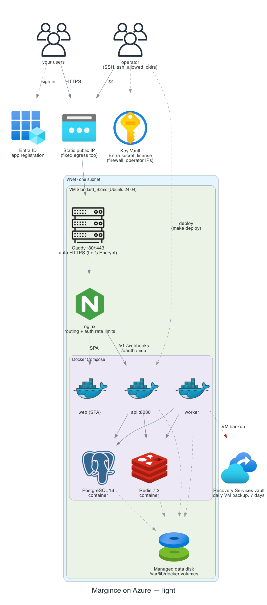
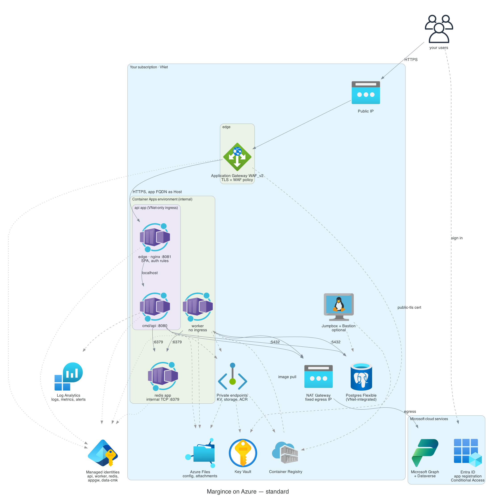
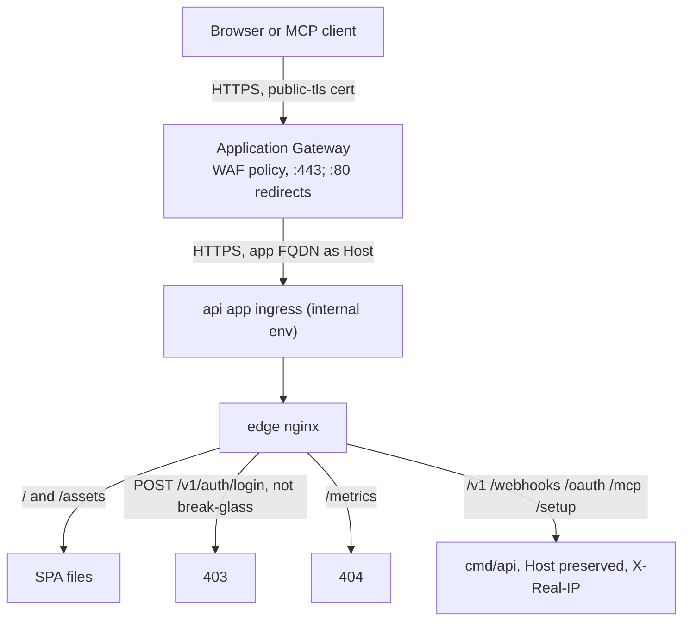
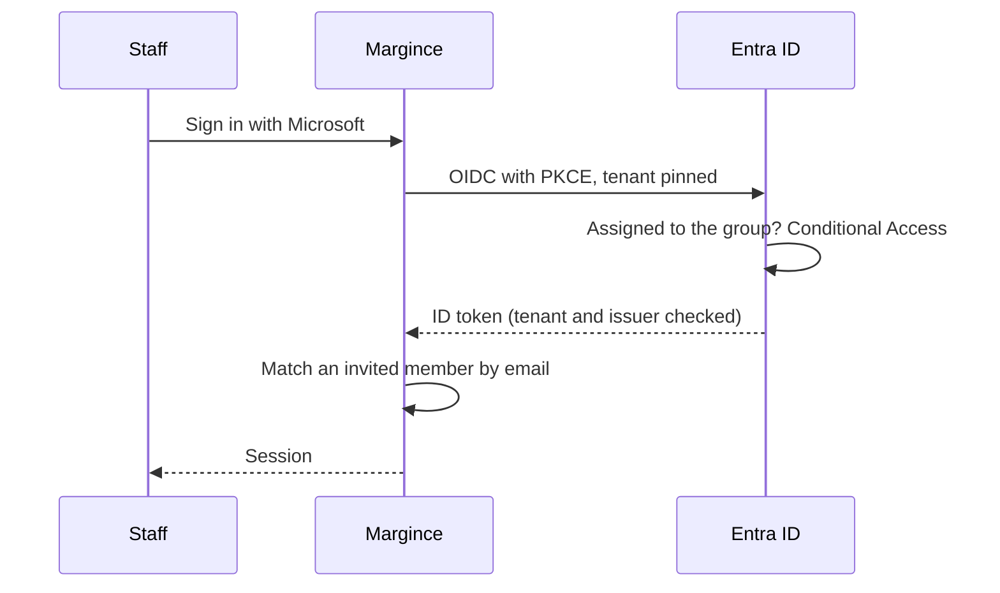

# Architecture

Two flavours share the same identity model (Entra ID app registration,
assignment required, Conditional Access) and differ in how the application
runs.

## Light: one VM

- **Public surface**: the VM's static public IP on 80/443 (Caddy); SSH on 22
  from `ssh_allowed_cidrs` only.
- **Egress**: the VM's static public IP (allowlist it in a Dataverse IP
  firewall if needed).
- **No high availability**; Azure Backup keeps a daily VM recovery point for
  7 days.

## Standard: containers

### Overview

- **Public surface**: the Application Gateway's public IP only, with the WAF
  policy (rate limits on the credential endpoints, OWASP and bot rule sets).
  The gateway terminates TLS with the `public-tls` Key Vault certificate and
  forwards over HTTPS to the api app's ingress on the internal environment.
  The ingress targets the edge nginx container, which serves the SPA,
  refuses password login outside the break-glass ranges, rate limits
  authentication paths per client, and forwards API paths to `cmd/api` on
  localhost.
- **Private**: the Container Apps environment (internal load balancer), the
  api app ingress (VNet-only), `cmd/api`, the worker, the redis app
  (internal TCP only), Postgres (VNet-integrated), Key Vault, storage and
  registry (private endpoints). During setup, `operator_ip_allowlist` can
  open Key Vault, storage and the registry to one operator address.
- **Egress**: through the NAT Gateway's single public IP, which a Dataverse IP
  firewall can allowlist.

## Request path

## Staff sign-in

## Identities

| Identity | Used by | Allowed to |
|---|---|---|
| `appgw` | Application Gateway | read the `public-tls` certificate secret |
| `api` | api app (cmd/api and edge) | read its own Key Vault secrets, pull images |
| `worker` | worker app | read its own Key Vault secrets, pull images |
| `redis` | redis app | read the Redis password secret |
| `dataverse` | api and worker | nothing in Azure; registered as a Dataverse application user |
| `data-cmk` | Postgres, storage | wrap and unwrap with the data key |
| jumpbox (system) | jumpbox VM | push images |
| Entra app | staff sign-in, Graph mail and calendar | delegated Graph permissions, assignment required |

## Estimated monthly cost, standard (list prices, West Europe)

| Component | EUR / month |
|---|---|
| Container Apps: api (3 replicas), worker, redis | 170-260 |
| Postgres B2s, 64 GiB, backups | ~65 |
| Container Registry Premium | ~45 |
| NAT Gateway and IP | ~35 |
| Private endpoints (4) and DNS zones | ~33 |
| Log Analytics, flow logs, traffic analytics | 30-50 |
| Storage (ZRS), backup, Key Vault | 25-35 |
| Jumpbox (on demand), Bastion Developer | 10-25 |
| **Total** | **~410-545** |

Excludes bandwidth, LLM usage and licence. Microsoft recommends General
Purpose Postgres for production: `GP_Standard_D2ds_v5` adds about EUR 75,
zone-redundant HA on top about EUR 140.
