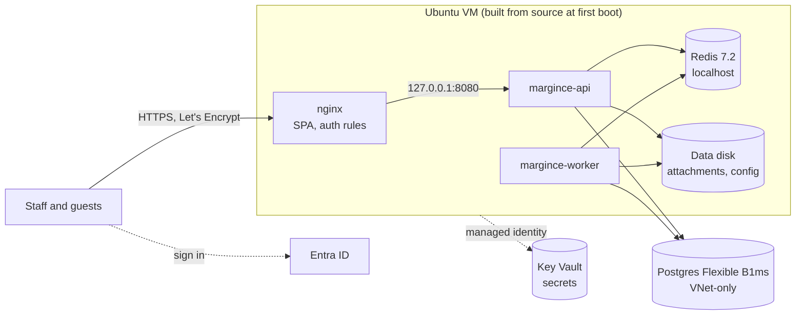
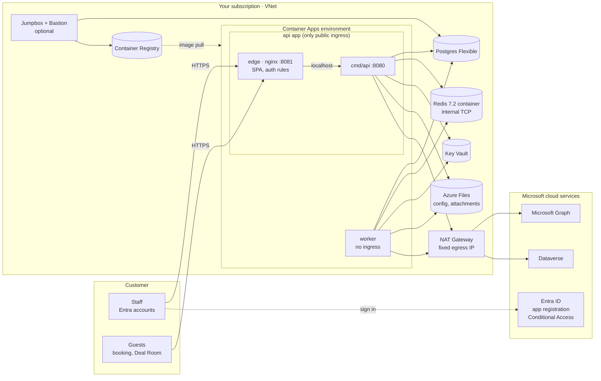
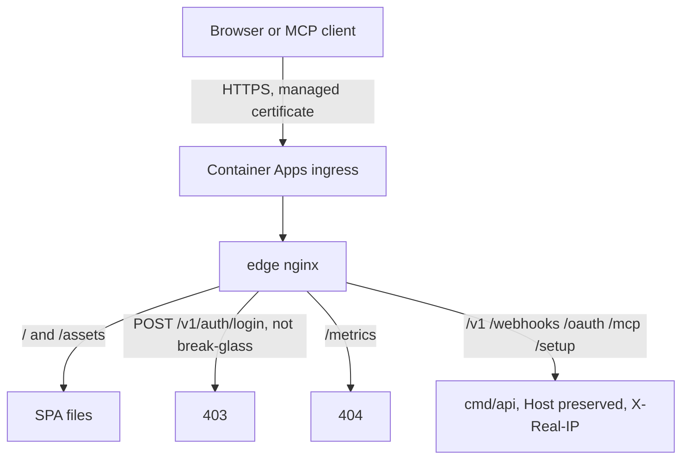
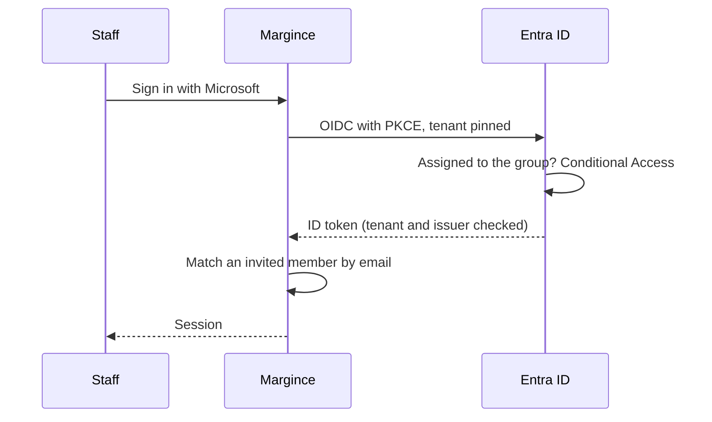

# Architecture

Two flavours share the same identity model (Entra ID app registration,
assignment required, Conditional Access) and differ in how the application
runs.

## Light: one VM

- **Public surface**: nginx on 80/443; SSH only through Azure Bastion
  Developer.
- **Egress**: the VM's static public IP (allowlist it in a Dataverse IP
  firewall if needed).
- **No high availability**; Postgres keeps 7 days of point-in-time restore.

## Standard: containers

### Overview

- **Public surface**: the api app's ingress only. It targets the edge nginx
  container, which serves the SPA, refuses password login outside the
  break-glass ranges, rate limits authentication paths per client, and
  forwards API paths to `cmd/api` on localhost.
- **Private**: `cmd/api`, the worker, the Redis container (internal TCP only), Postgres (VNet-integrated), Key
  Vault, storage and registry (private endpoints). During setup,
  `operator_ip_allowlist` can open Key Vault, storage and the registry to one
  operator address.
- **Egress**: through the NAT Gateway's single public IP, which a Dataverse IP
  firewall can allowlist.

## Request path

## Staff sign-in

## Identities

| Identity | Used by | Allowed to |
|---|---|---|
| `api` | api app (cmd/api and edge) | read its own Key Vault secrets, pull images |
| `worker` | worker app | read its own Key Vault secrets, pull images |
| `dataverse` | api and worker | nothing in Azure; registered as a Dataverse application user |
| `data-cmk` | Postgres, storage | wrap and unwrap with the data key |
| jumpbox (system) | jumpbox VM | push images |
| Entra app | staff sign-in, Graph mail and calendar | delegated Graph permissions, assignment required |

## Estimated monthly cost, standard (list prices, West Europe)

| Component | EUR / month |
|---|---|
| Container Apps: api (3 replicas), worker, redis | 170-260 |
| Postgres B2s, 64 GiB, backups | ~65 |
| Container Registry Premium | ~45 |
| NAT Gateway and IP | ~35 |
| Private endpoints (4) and DNS zones | ~33 |
| Log Analytics, flow logs, traffic analytics | 30-50 |
| Storage (ZRS), backup, Key Vault | 25-35 |
| Jumpbox (on demand), Bastion Developer | 10-25 |
| **Total** | **~410-545** |

Excludes bandwidth, LLM usage and licence. Microsoft recommends General
Purpose Postgres for production: `GP_Standard_D2ds_v5` adds about EUR 75,
zone-redundant HA on top about EUR 140.
